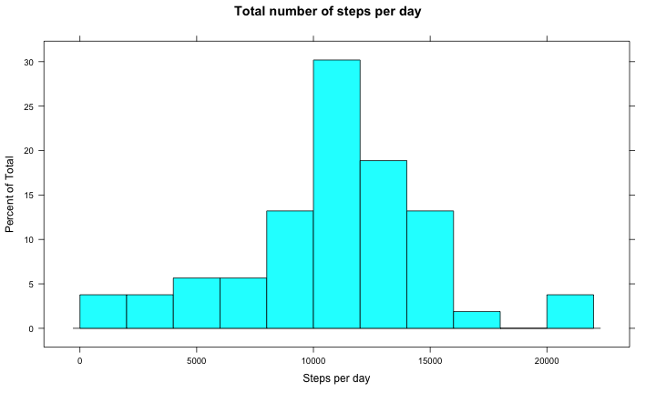
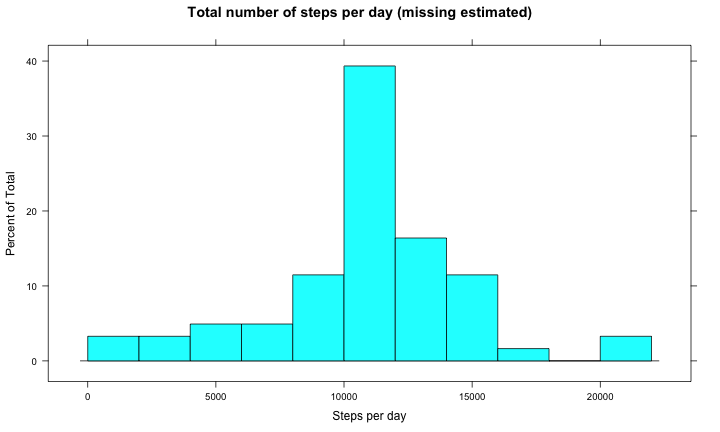

## Reproductible Research
by Roger D. Peng, PhD, Jeff Leek, PhD, Brian Caffo, PhD
Coursera June 2014 session 

### Assignement 1
https://github.com/coursera-jm/RepData_PeerAssessment1

## Introduction

We want first ensure, as per instructions, that all statement will be outputs. 

```r
# set global options
opts_chunk$set(echo=TRUE)
```

We also initalize some common variables:

```r
# cleanup
rm(list=ls())

#libraries
library(lattice)

# for reproductibility
set.seed(590607)

# some usefule variables
dt = Sys.time()
date <- format(dt,"%d-%b-%Y")
time <- format(dt,"%H:%M:%S")

Rversion <- version$version.string
```

This analysis has been performed using R software package for statistical analysis.
The version of R used was R version 3.1.0 (2014-04-10).

This socument has been generated on 12-Jun-2014 at 20:02:49.

## Analysis as per assignement

### 1. Loading and preprocessing the data

  - Show any code that is needed to load the data

We download the dataset from the internet and unzip it. Then, we used read.csv to read the file.


```r
# baseDir will be prefixing all data accesses
baseDir <- "."

# create data sub-directory if necessary
dataDir <- file.path(baseDir, "data")
if(!file.exists(dataDir)) { dir.create(dataDir) }

zipFilePath <- file.path(dataDir, "activity.zip")
dateFilePath <- file.path(dataDir, "date_time_downloaded.txt")
# download original data if necessary (skip if exists already as it takes time and bandwith)
if(!file.exists(zipFilePath)) { 
  zipFileUrl <- "https://d396qusza40orc.cloudfront.net/repdata%2Fdata%2Factivity.zip"
  download.file (zipFileUrl, zipFilePath, method="curl")
  DTDownloaded <- format(Sys.time(), "%Y-%b-%d %H:%M:%S")
  cat (DTDownloaded, file=dateFilePath)
} else {
  DTDownloaded <- scan(file=dateFilePath, what="character", sep="\n")
}

filePath <- file.path(dataDir, "activity.csv")
# unzip file if necessary
if(!file.exists(filePath)) { 
  unzip (zipFilePath, exdir=dataDir)
}

# read dataset and load data in R
dataset <- read.csv(filePath, header = TRUE) 

cat ("The dataset is located at", filePath, "and was downloaded on downloaded on", DTDownloaded)
```

```
## The dataset is located at ./data/activity.csv and was downloaded on downloaded on 2014-Jun-12 12:06:46
```

We verify the dataset structure:

```r
str(dataset)
```

```
## 'data.frame':	17568 obs. of  3 variables:
##  $ steps   : int  NA NA NA NA NA NA NA NA NA NA ...
##  $ date    : Factor w/ 61 levels "2012-10-01","2012-10-02",..: 1 1 1 1 1 1 1 1 1 1 ...
##  $ interval: int  0 5 10 15 20 25 30 35 40 45 ...
```

The variables included in this dataset are:

    - steps: Number of steps taking in a 5-minute interval (missing values are coded as NA)
    - date: The date on which the measurement was taken in YYYY-MM-DD format
    - interval: Identifier for the 5-minute interval in which measurement was taken

The dataset is stored in a comma-separated-value (CSV) file and there are a total of ``17568`` observations in this dataset for 17,568 expected from the instructions.

- Process/transform the data (if necessary) into a format suitable for your analysis

a. Let's get dates instead of character strings

```r
dataset$date <- as.Date(dataset$date)
str(dataset$date)
```

```
##  Date[1:17568], format: "2012-10-01" "2012-10-01" "2012-10-01" "2012-10-01" ...
```

b. Interval are a number in the form hhmm where hh=hours and mm= minutes. We create 2 variables: time since minght, in minutes, and a string factor instead of the numeric concatenation of hours and minutes.

```r
dataset$minute <- dataset$interval %% 100
dataset$hour <- dataset$interval %/% 100
dataset$elapsed <- dataset$hour * 60 + dataset$minute
# replace interval by a factor
dataset$interval <- as.factor(sprintf("%02d:%02d", dataset$hour, dataset$minute))
```


```r
# create a table with number of steps per day
stepsPerDay <- aggregate(steps ~ date, data=dataset, sum)
```

### 2. What is mean total number of steps taken per day?

For this part of the assignment, you can ignore the missing values in the dataset.

  - Make a histogram of the total number of steps taken each day

```r
histogram(stepsPerDay$steps, breaks=10, main="Total number of steps per day", xlab="Steps per day")
```

 

  - Calculate and report the mean and median total number of steps taken per day

The mean and median number of steps per days are as follow:

```r
mean(stepsPerDay$steps, na.rm=TRUE)
```

```
## [1] 10766
```

```r
median(stepsPerDay$steps, na.rm=TRUE)
```

```
## [1] 10765
```

### What is the average daily activity pattern?

1. Make a time series plot (i.e. type = "l") of the 5-minute interval (x-axis) and the average number of steps taken, averaged across all days (y-axis)

```r
plot(interval ~ steps, data=dataset, type="l")
```

```
## Warning: graphical parameter "type" is obsolete
```

 


2. Which 5-minute interval, on average across all the days in the dataset, contains the maximum number of steps?

```r
# mode, e.g. http://stackoverflow.com/questions/2547402/standard-library-function-in-r-for-finding-the-mode
Mode <- function(x) {
  ux <- unique(x)
  ux[which.max(tabulate(match(x, ux)))]
}
Mode(dataset$interval)
```

```
## [1] 00:00
## 288 Levels: 00:00 00:05 00:10 00:15 00:20 00:25 00:30 00:35 00:40 ... 23:55
```

### Imputing missing values

Note that there are a number of days/intervals where there are missing values (coded as NA). The presence of missing days may introduce bias into some calculations or summaries of the data.

1. Calculate and report the total number of missing values in the dataset (i.e. the total number of rows with NAs)

```r
sum(is.na(dataset$steps))
```

```
## [1] 2304
```

2. Devise a strategy for filling in all of the missing values in the dataset. The strategy does not need to be sophisticated. For example, you could use the mean/median for that day, or the mean for that 5-minute interval, etc.

```r
# calculate the mean for each day from other days
meanPerDay <- aggregate(steps ~ date, data=dataset, mean)
```

3. Create a new dataset that is equal to the original dataset but with the missing data filled in.

```r
# replace missig values w
for(r in 1:100) { #nrow(dataset)){
  if (is.na(dataset$steps[r])) {
    repl <- meanPerDay$steps[meanPerDay$date == dataset$date[r]];
    cat (r, repl, dataset$date[r], "\n");
    #dataset$steps[r] <- repl;
  }
}
```

```
## 1  15614 
## 2  15614 
## 3  15614 
## 4  15614 
## 5  15614 
## 6  15614 
## 7  15614 
## 8  15614 
## 9  15614 
## 10  15614 
## 11  15614 
## 12  15614 
## 13  15614 
## 14  15614 
## 15  15614 
## 16  15614 
## 17  15614 
## 18  15614 
## 19  15614 
## 20  15614 
## 21  15614 
## 22  15614 
## 23  15614 
## 24  15614 
## 25  15614 
## 26  15614 
## 27  15614 
## 28  15614 
## 29  15614 
## 30  15614 
## 31  15614 
## 32  15614 
## 33  15614 
## 34  15614 
## 35  15614 
## 36  15614 
## 37  15614 
## 38  15614 
## 39  15614 
## 40  15614 
## 41  15614 
## 42  15614 
## 43  15614 
## 44  15614 
## 45  15614 
## 46  15614 
## 47  15614 
## 48  15614 
## 49  15614 
## 50  15614 
## 51  15614 
## 52  15614 
## 53  15614 
## 54  15614 
## 55  15614 
## 56  15614 
## 57  15614 
## 58  15614 
## 59  15614 
## 60  15614 
## 61  15614 
## 62  15614 
## 63  15614 
## 64  15614 
## 65  15614 
## 66  15614 
## 67  15614 
## 68  15614 
## 69  15614 
## 70  15614 
## 71  15614 
## 72  15614 
## 73  15614 
## 74  15614 
## 75  15614 
## 76  15614 
## 77  15614 
## 78  15614 
## 79  15614 
## 80  15614 
## 81  15614 
## 82  15614 
## 83  15614 
## 84  15614 
## 85  15614 
## 86  15614 
## 87  15614 
## 88  15614 
## 89  15614 
## 90  15614 
## 91  15614 
## 92  15614 
## 93  15614 
## 94  15614 
## 95  15614 
## 96  15614 
## 97  15614 
## 98  15614 
## 99  15614 
## 100  15614
```

```r
str(dataset$steps)
```

```
##  int [1:17568] NA NA NA NA NA NA NA NA NA NA ...
```

4. Make a histogram of the total number of steps taken each day and Calculate and report the mean and median total number of steps taken per day. Do these values differ from the estimates from the first part of the assignment? What is the impact of imputing missing data on the estimates of the total daily number of steps?

```r
histogram(stepsPerDay$steps, breaks=10, main="Total number of steps per day", xlab="Steps per day")
```

 

```r
stepsPerDay <- aggregate(steps ~ date, data=dataset, sum)
mean(stepsPerDay$steps, na.rm=TRUE)
```

```
## [1] 10766
```

```r
median(stepsPerDay$steps, na.rm=TRUE)
```

```
## [1] 10765
```

3. Make a time series plot (i.e. type = "l") of the 5-minute interval (x-axis) and the average number of steps taken, averaged across all days (y-axis)

```r
plotxy(dataset$steps ~ dataset$interval,type="l")
```

```
## Error: could not find function "plotxy"
```

### Are there differences in activity patterns between weekdays and weekends?

For this part the "weekdays()" function may be of some help here. Use the dataset with the filled-in missing values for this part.

1. Create a new factor variable in the dataset with two levels -- "weekday" and "weekend" indicating whether a given date is a weekday or weekend day.

```r
dataset$day <-"weekday"
dataset$day[weekdays(as.Date(dataset$date), abb=T) %in% c("Sat","Sun")] <- "weekend"
```


2. Make a panel plot containing a time series plot (i.e. type = "l") of the 5-minute interval (x-axis) and the average number of steps taken, averaged across all weekday days or weekend days (y-axis).

```r
intervalDay <- aggregate(steps ~ interval + day, data=dataset, mean)
plot(steps ~ interval, data=intervalDay, type="l")
```

 

```r
plot(steps ~ day, data=intervalDay, type="l")
```

```
## Warning: NAs introduced by coercion
## Warning: no non-missing arguments to min; returning Inf
## Warning: no non-missing arguments to max; returning -Inf
```

```
## Error: need finite 'xlim' values
```

 
table(intervalDay)

## References

1. R Core Team. R: A language and environment for statistical computing. URL: http://www.R-project.org. R Foundation for Statistical Computing, 2013.

2. R Markdown Page. URL: http://www.rstudio.com/ide/docs/authoring/using_markdown. 


